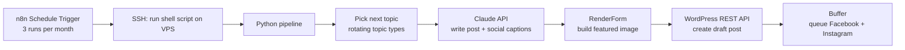
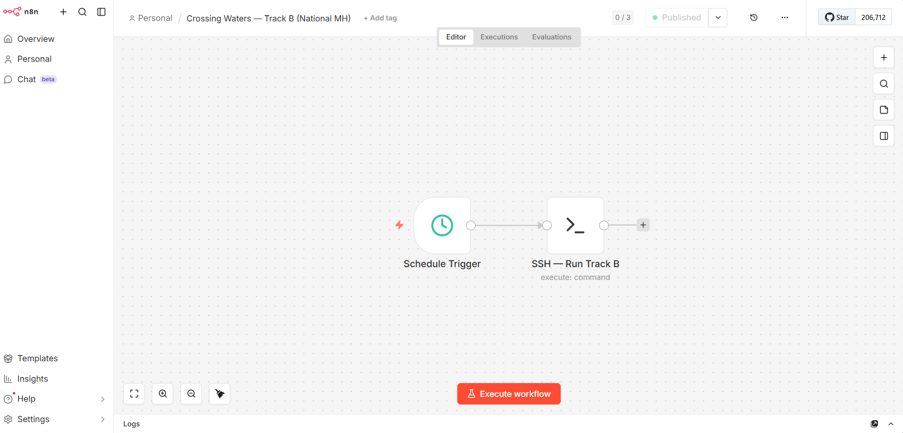

# CWN Content Automation

Automated blog and social media publishing pipeline for a nationwide mental health treatment directory.

## Index
- [Goal](#goal)
- [Description](#description)
- [How It Works](#how-it-works)
- [Skills](#skills)
- [Technology](#technology)
- [Results](#results)
- [Repository Structure](#repository-structure)
- [Setup](#setup)
- [Note on Scope](#note-on-scope)

## Goal
Keep a large directory website publishing fresh, educational content on a steady schedule without manual work each time, and with every step checkable.

## Description
This repo documents a content pipeline built for [CrossingWatersNetwork.org](https://crossingwatersnetwork.org), a nationwide directory of mental health treatment facilities. An n8n schedule triggers a shell script on a VPS. The script runs a Python pipeline that uses the Claude API to write a blog post, builds a featured image, creates the post in WordPress, and queues Facebook and Instagram posts in Buffer.

This is a **simplified, public version**. It shows the structure and workflow design. Production prompts, topic logic and credentials are not included. The full version is available to walk through on request.

## How It Works





1. **Schedule:** n8n fires a cron trigger on the 3rd, 13th and 23rd of each month at 11:00.
2. **Run:** n8n connects over SSH and starts a wrapper script. The script activates the Python virtual environment and writes to a log file. Its exit code goes back to n8n so failures are visible.
3. **Topic:** the pipeline rotates through topic types (education, levels of care, family support, seasonal).
4. **Write:** the Claude API generates the post and social captions.
5. **Image:** a templated featured image is generated and uploaded to WordPress.
6. **Publish:** a draft post is created through the WordPress REST API.
7. **Social:** Facebook and Instagram posts are queued in Buffer.

**Reliability choices**
- `--dry-run` mode generates content only, with no publishing, for safe testing.
- If image generation or Buffer queuing fails, the WordPress post is still created and the warning is logged.
- Secrets live in a `.env` file kept out of version control.

## Skills
Workflow automation, API integration, scheduled jobs, content operations, SEO content planning, error handling, environment and secrets management, technical documentation.

## Technology
n8n, Python, Bash, Claude API, WordPress REST API, Buffer, RenderForm, SSH, cron, VPS hosting (Hostinger).

## Results
- Blog posts are produced on a 3-per-month automated schedule.
- Facebook and Instagram posts are queued automatically with each post.
- The site the pipeline supports lists 13,745 mental health treatment facilities across all 50 states.

## Repository Structure
```
cwn-content-automation/
├── README.md
├── .gitignore
├── .env.example            # variable names only, no values
├── workflows/
│   └── content-schedule.json   # simplified n8n workflow
├── scripts/
│   ├── run.sh                  # wrapper: venv, logging, exit code
│   └── pipeline_outline.py     # structure only, no production logic
└── images/                     # workflow screenshots
```

## Setup
1. Import `workflows/content-schedule.json` into n8n and attach your own SSH credential.
2. Copy `.env.example` to `.env` and add your own keys.
3. Adjust the path in the workflow command to where your project lives.

## Note on Scope
Production prompts, topic selection logic and credentials are intentionally left out.
